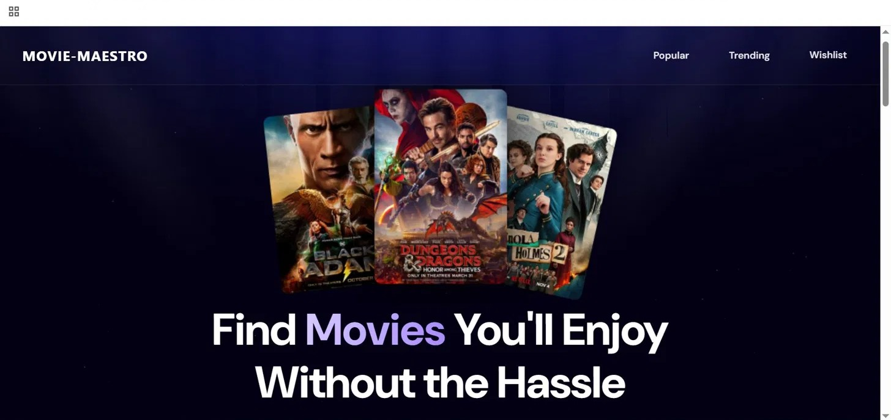
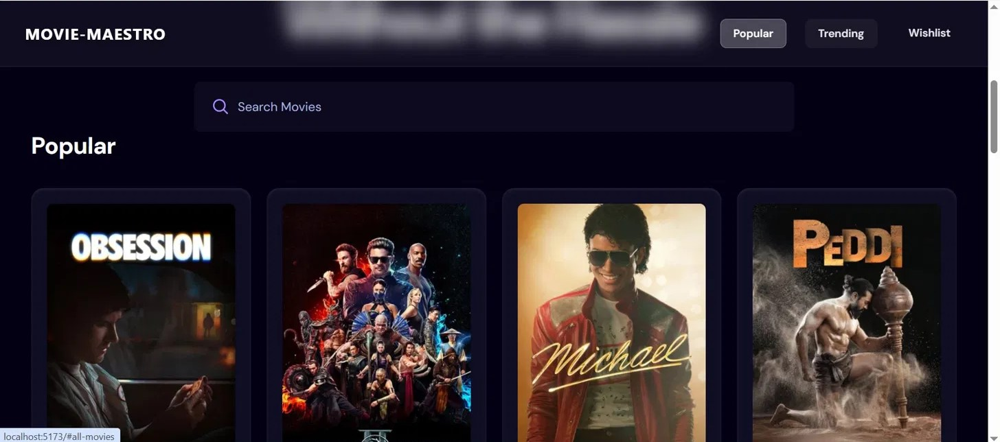
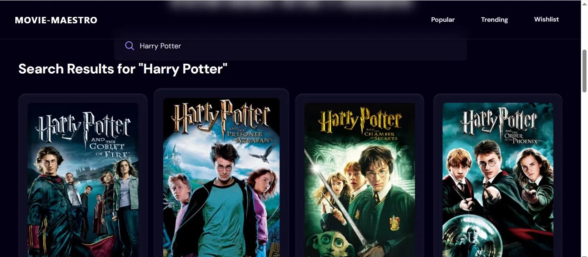
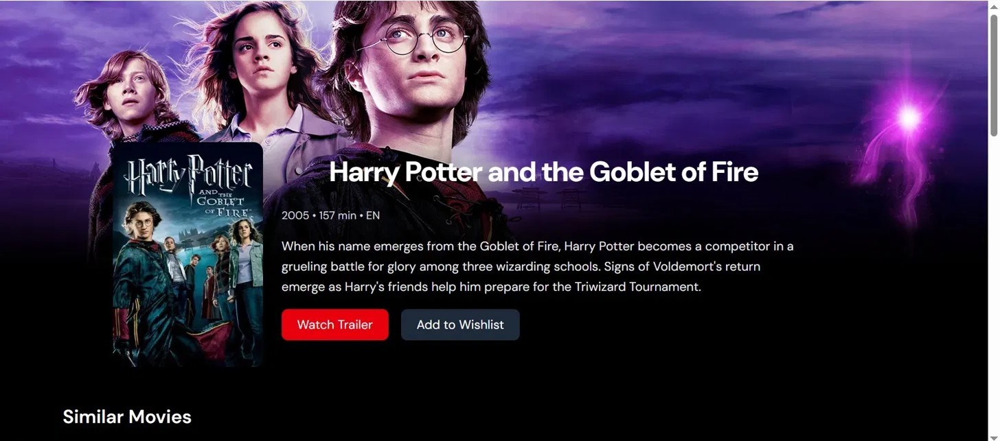
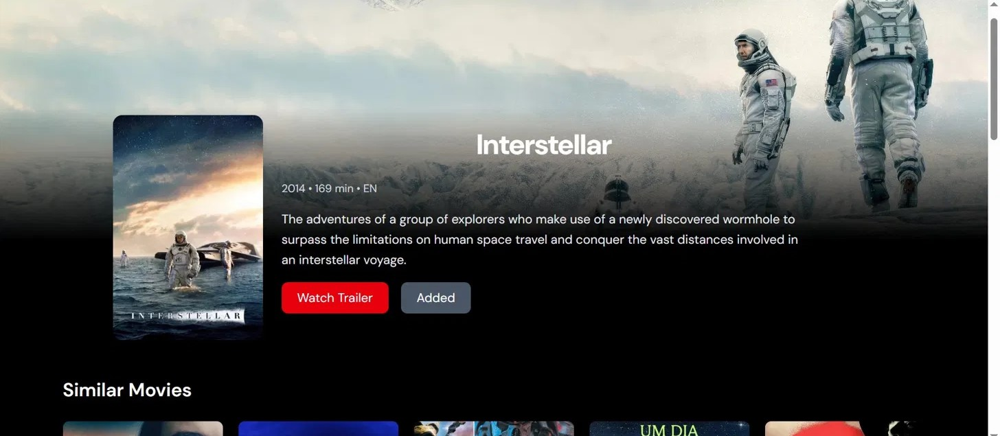
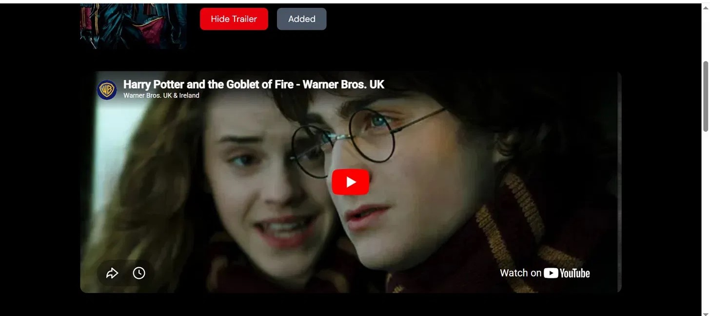
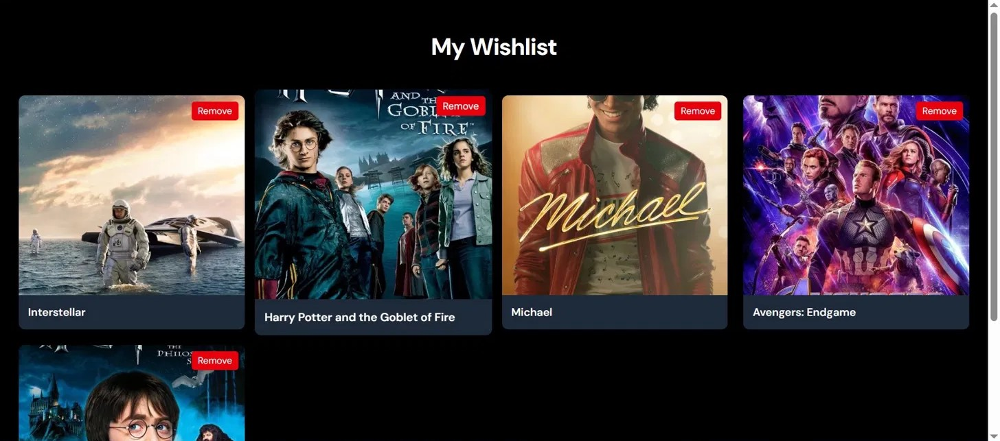

# 🎬 Movie Maestro

A sleek, modern movie discovery app that fetches real-time data from the **TMDB API**, lets users explore Popular and Trending films, watch trailers, and save movies to a personal Wishlist powered by **Appwrite**.



---

## ✨ Features

- 🔥 **Popular & Trending** — Browse real-time popular and trending movies fetched from TMDB
- 🔍 **Search** — Instant search across thousands of movies
- 🎥 **Movie Detail Page** — View movie info, runtime, language, overview, and similar movies
- ▶️ **Watch Trailer** — Embedded YouTube trailer on the movie detail page
- ❤️ **Wishlist** — Save and manage your favourite movies (persisted via Appwrite)
- 🌙 **Dark UI** — Clean, cinematic dark-themed interface

---

## 📸 Screenshots

### 🏠 Home Page


### 🎬 Popular & Trending


### 🔍 Search


### 🎥 Movie Detail


### 📄 Movie Detail (Alternative)


### ▶️ Watch Trailer


### ❤️ Wishlist


---

## 🛠️ Tech Stack

| Layer | Technology |
|---|---|
| Frontend | React.js, CSS |
| Backend/Database | Appwrite |
| Movie Data | TMDB API |
| Trailers | YouTube Embed |

---

## 🚀 Getting Started

### Prerequisites
- Node.js v18+
- Appwrite account
- TMDB API key

### Setup

```bash
# Clone the repo
git clone https://github.com/Uzair-Aslam-Dev/Movie-Maestro.git
cd Movie-Maestro

# Install dependencies
npm install

# Add your environment variables
# Create a .env file with:
# VITE_TMDB_API_KEY=your_tmdb_api_key
# VITE_APPWRITE_PROJECT_ID=your_appwrite_project_id
# VITE_APPWRITE_DATABASE_ID=your_database_id
# VITE_APPWRITE_COLLECTION_ID=your_collection_id

# Start the app
npm run dev
```

Open [http://localhost:5173](http://localhost:5173) in your browser.

---

## 📁 Project Structure

```
Movie-Maestro/
├── src/
│   ├── components/     # Reusable UI components
│   ├── pages/          # Page components (Home, Detail, Wishlist)
│   ├── appwrite.js     # Appwrite configuration
│   └── tmdb.js         # TMDB API calls
├── screenshots/        # Project screenshots
└── public/             # Static assets
```

---

## 👨‍💻 Built By

**Muhammad Uzair Aslam** — [GitHub](https://github.com/Uzair-Aslam-Dev) · [LinkedIn](https://www.linkedin.com/in/uzair-aslam-929694364)
